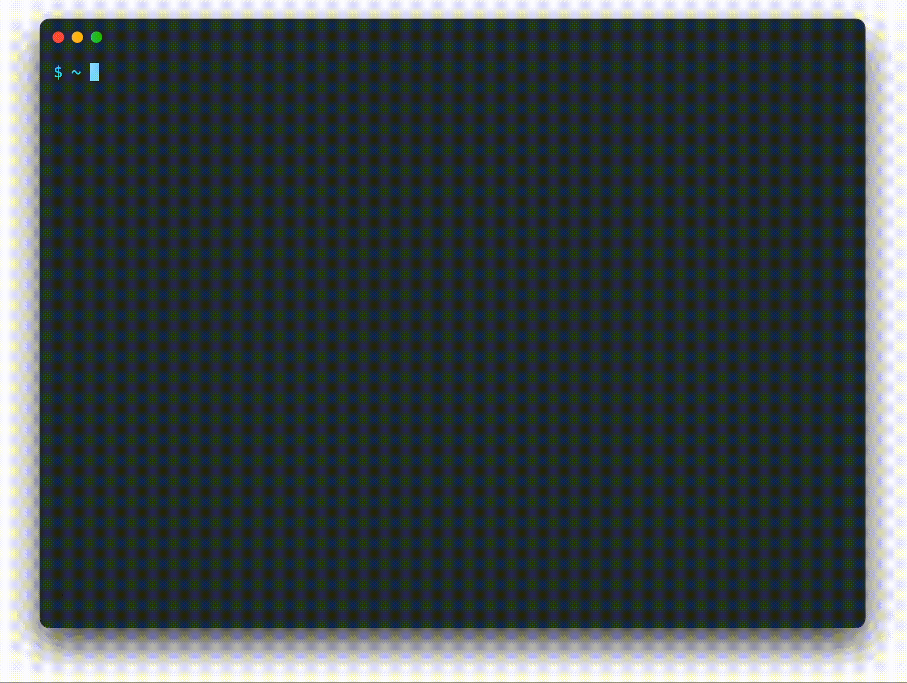

# wut

**CLI that explains the output of your last command.**

Just type `wut` and an LLM will help you understand whatever's in your terminal. You'll be surprised how useful this can be. It can help you:

- Understand stack traces
- Decipher error codes
- Fix incorrect commands
- Summarize logs



## Installation

```bash
> pipx install wut-cli
```

<!-- On MacOS or Linux, you can install via Homebrew:

```bash
> brew install wut
```

On other systems, you can install using pip:

```bash
> pipx install wut-cli
``` -->

Once installed, you can use OpenAI or Claude as your LLM provider. Just add the appropriate API key to your environment:

```bash
> export OPENAI_API_KEY="..."
> export ANTHROPIC_API_KEY="..."
```

You can also use a local model with Ollama. Just add the model name that's being served to your environment:

```bash
> export OLLAMA_MODEL="..."
```

If you're using OpenAI, you can customize your model and API URL by adding the following to your environment:

```bash
> export OPENAI_MODEL="..." # Default to "gpt-4o"
> export OPENAI_BASE_URL="..." # Default to None
```

## Usage

`wut` must be used inside a `tmux` or `screen` session to capture the last command's output. To use it, just type `wut` after running a command:

```bash
> git create-pr
git: 'create-pr' is not a git command.
> wut
```

You'll quickly get a brief explanation of the issue:

```
This error occurs because Git doesn't have a built-in `create-pr` command.
To create a pull request, you typically need to:

1. Push your branch to the remote repository
2. Use the GitHub web interface
```

If you have a _specific question_ about your last command, you can include a query:

```bash
> brew install pip
...
> wut "how do i add this to my PATH variable?"
```

## Roadmap

1. [If possible,](https://stackoverflow.com/questions/24283097/reusing-output-from-last-command-in-bash/75629157#75629157) drop the requirement of being inside a tmux or screen session.
2. Add a `--fix` option to automatically execute a command suggested by `wut`.
3. Add `wut` to Homebrew.
4. Make some unit tests.
